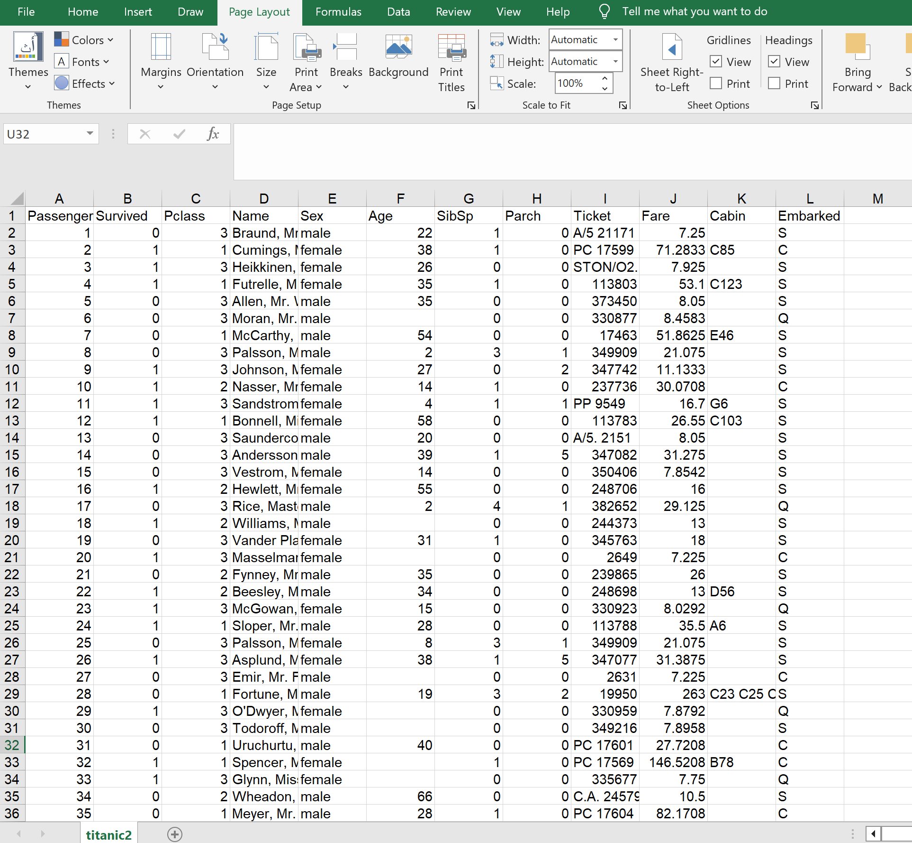
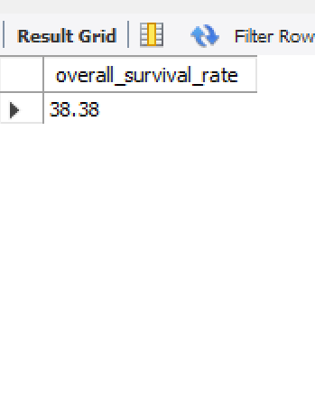
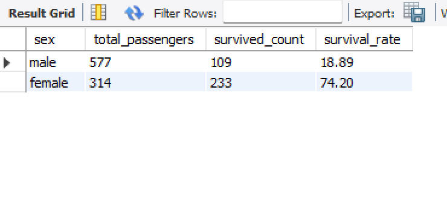
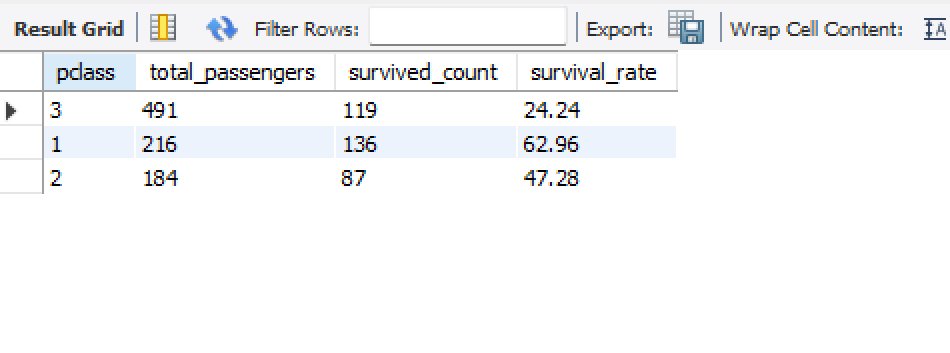

# Titanic Passengers Data Analysis & Exploration using SQL

An end-to-end SQL project focused on data cleaning, exploratory data analysis (EDA), and deep-dive insights into the factors influencing passenger survival rates aboard the Titanic.

## 📌 Project Overview
This project utilizes a structured database of Titanic passengers (`titanic2`) to answer critical socio-economic and demographic questions about survival outcomes. Through advanced SQL queries, it explores how variables such as age, gender, passenger class (Pclass), cabin assignment, family size, and ticket fares impacted a passenger's chance of survival.

## 🛠️ Key Features & SQL Techniques Used
* **Data Cleaning:** Handled invalid or missing data, such as converting `0` values in the Age column to `NULL` to maintain statistical accuracy.
* **Exploratory Data Analysis (EDA):** Calculated global metrics like the overall survival rate.
* **Demographic Breakdown:** Analyzed survival rates by gender, age groups (Children vs. Adults), and family sizes.
* **Socio-Economic Insights:** Analyzed survival trends based on Passenger Class (Pclass), ticket pricing tiers, and embarkation ports.
* **Advanced SQL Features:** Used complex conditional logic (`CASE WHEN`), aggregates (`AVG`, `SUM`, `COUNT`), and built a comprehensive database `VIEW` (`Survival_Profile`) for multi-factor analysis.

## 📂 Repository Files
All project components are available directly in the root directory for easy access:

* **SQL Script:** `titanic_survival_analysis.sql` (Full analysis and data cleaning script)
* **Exported Data (CSV):** Tabular query results (`overall_survival_rate.csv`, `survival_by_sex.csv`, `survival_by_pclass.csv`, `survival_profile.csv`)
* **Visual Previews (PNG):** Screenshots of database outputs and charts.

## 📊 Sample Visual Insights
Here are some previews of the data and outputs generated from the analysis:

### 1. Dataset Preview
Looking at the initial state of the dataset in MySQL Workbench:

### 2. Overall Survival Rate
The baseline probability of survival calculated across all passengers:

### 3. Survival Rate by Gender (Sex)
A clear breakdown highlighting the stark contrast in survival rates between female and male passengers:

### 4. Survival Rate by Passenger Class (Pclass)
Analyzing how a passenger's socio-economic status impacted their chances of survival:

*(Note: You can explore the full tabular results inside the corresponding `.csv` files available in this repository.)*

## 💻 Tech Stack
* **Database Management System:** MySQL
* **Tool:** MySQL Workbench
* **Reporting:** CSV (for query outputs)

## 🚀 How to Run the Project
1. Clone this repository to your local machine.
2. Open **MySQL Workbench**.
3. Import your Titanic dataset into a table named `titanic2`.
4. Run the queries in `titanic_survival_analysis.sql` sequentially to observe the cleaning steps and analytical outputs.
